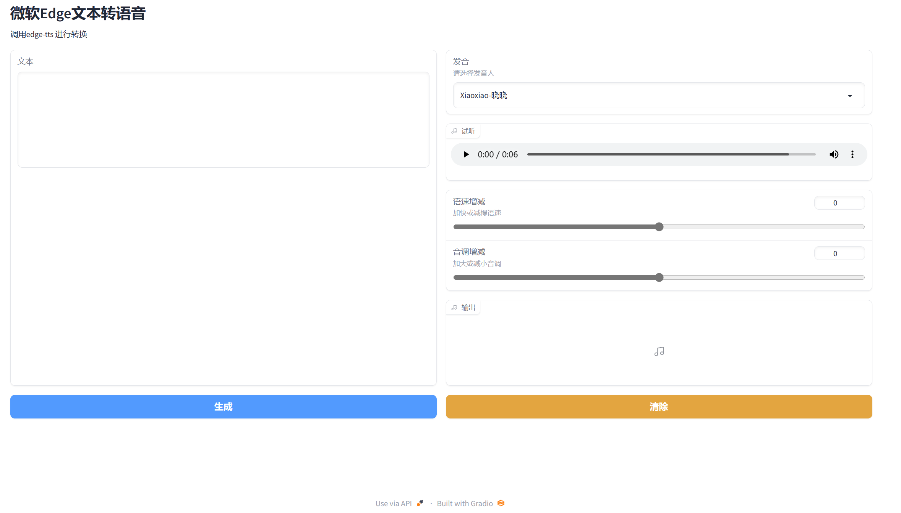

# edge-tts-webui

`edge-tts-webui` คือเวอร์ชันที่มีอินเทอร์เฟซแบบเว็บของ [edge-tts](https://github.com/rany2/edge-tts) โดยพัฒนาโดยใช้ `gradio`



## การติดตั้ง

```bash
pip install edge-tts
pip install gradio
pip install asyncio


การใช้งาน
เรียกใช้งานโดยรันคำสั่ง
python app.py

การเข้าถึง
localhost:7860